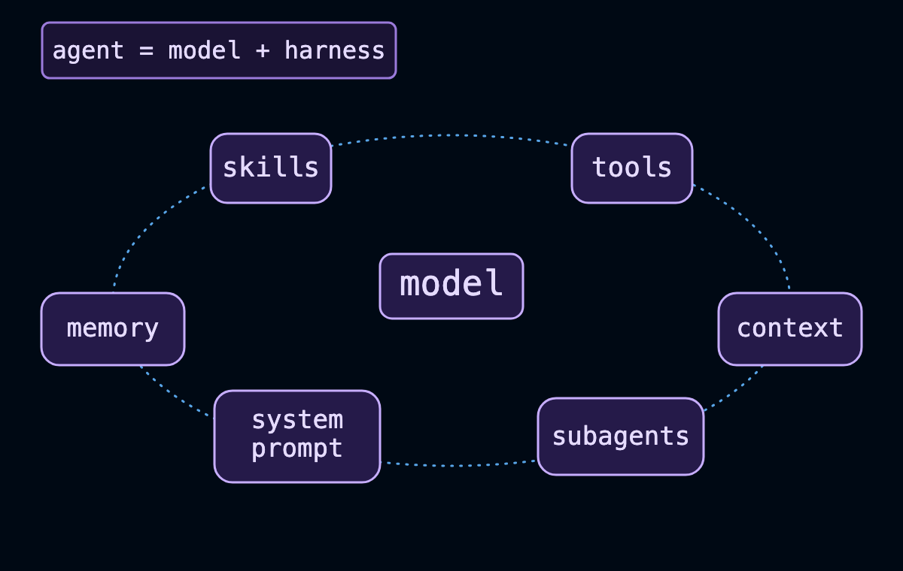
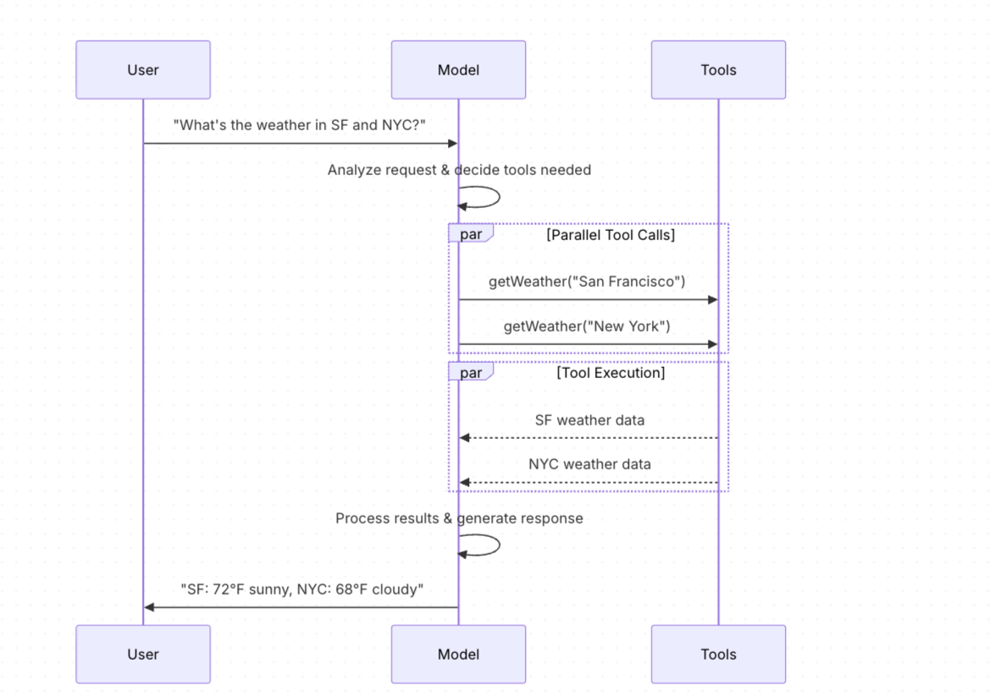
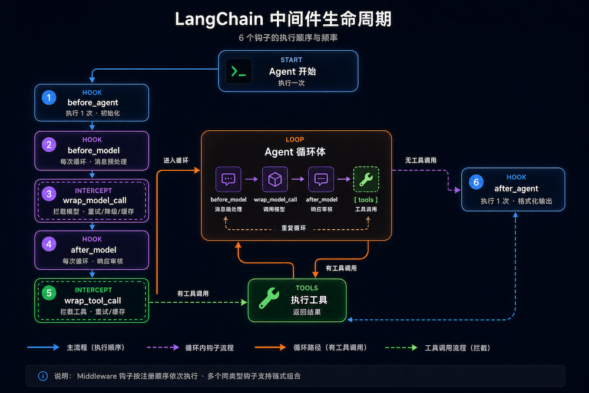

<!--
 * @Author: hxx
 * @Date: 2026-07-17 11:25:03
 * @LastEditors: hxx
 * @LastEditTime: 2026-07-20 14:31:25
-->
# langChain的生态系统

## langChain

langChain通过为智能体、模型、嵌入数据、向量存储等元素提供标准化接口，帮助开发者构建基于大语言模型的应用程序
## langSmith

用于构建、测试、监控大语言模型应用的统一开发平台；
功能：用于调试运行效果不佳的大语言模型应用，分析运行情况

## langGraph
利用底层智能体编排框架，可以构建处理复杂任务的智能体

## deep Agents
深度智能体——打造出超越简单工具调用功能的复杂“深度”智能体。这些智能体结合了规划功能、子智能体的生成、文件系统访问能力以及各种详细指令，从而能够处理各种复杂的多步骤任务。其设计理念源自 Claude Code 和 Deep Research 等应用。


## 对接国内的大模型

### deepseek
### 智谱
### MINIMAX

## Agents的核心组件


### model
选择为智能体提供合适的模型，模型可以是国内的、或者国外的各种模型

### skills

### tools
为agent提供所需要的工具

### context

### memory

### system prompt 系统提示，就是一个前置的消息
决定了智能体处理任务的方式。系统提示参数可以接受字符串或 SystemMessage 格式的内容。对于需要在运行时动态生成的提示内容，请使用中间件来处理。

### subagents

## Parameters 参数

### model  模型/样式

### apiKey
用于向该模型的提供者进行身份验证的密钥。通常在您注册以使用该模型时会被发放。通常是通过设置相应的参数来获取该密钥的

### temperature  温度
该参数用于控制模型输出的随机性。数值越高，输出结果越具有创造性；数值越低，输出结果则越具有确定性。

### maxTokens
在响应过程中，可以有效地控制输出内容的长度。

### timeout  超时
在取消请求之前，等待模型响应的最大时间（以秒为单位）。

### maxRetries  最大重试次数
如果由于网络超时或速率限制等原因导致请求失败，系统会尝试重新发送该请求。每次重试时，系统会采用指数退避算法，并加入一定的随机延迟。网络错误、速率限制错误（429 码）和服务器错误（5xx 码）都会自动被重试。而由客户端引起的错误，如 401（未经授权）或 404 错误，则不会被重试。对于在不可靠网络环境下运行的长时间运行的任务，建议将此数值调整为 10 到 15 次。


## 模型调用的关键方法

### invoke方法
该模型以消息作为输入，在生成完整的回复后输出消息
#### 消息格式
1、单条消息
2、多条消息，每条消息都有一个消息角色，用来区分是谁发的消息
3、消息对象，HumanMessage(UserMessage)、AssistantMessage、SystemMessage

### stream流媒体播放
大多数模型都能够在内容生成的过程中实时输出结果。通过逐步显示输出内容，这种流式传输方式显著提升了用户体验，尤其是在需要处理较长文本内容时。

与 invoke() 不同， invoke() 在模型生成完整响应后会返回一个 AIMessage 。而 stream() 则返回多个 AIMessageChunk 对象，每个对象都包含输出文本的一部分。重要的是，流中的每个部分都可以通过合并来组成完整的消息。
### Batch  批量处理
为了提高处理效率，可以批量向模型发送多个请求。
将一系列独立的请求批量发送给模型，能够显著提升性能并降低成本，因为这些请求可以并行处理。

## 模型调用工具流程


### 给模型绑定工具
```
const model = new ChatOpenAI({ model: "gpt-5.5" });
const modelWithTools = model.bindTools([getWeather]);
```

## 消息类型

### 系统消息
用于告知模型应有的行为方式，并为各种交互提供必要的背景信息。

### 用户消息
人类输入的信息——代表了用户的输入内容以及用户与模型的交互行为。

### AI消息
AI 消息——由模型生成的回复内容，包括文本、工具调用信息以及元数据。

### 工具消息
工具消息——表示工具调用的输出结果

## tools
工具扩展了智能体的功能——使它们能够获取实时数据、执行代码、查询外部数据库，并在现实世界中采取相应行动。

在底层，这些“工具”其实都是具有明确定义的输入和输出参数的函数，这些函数会被传递给聊天模型。模型会根据对话的上下文来决定何时调用某个工具，以及应传递哪些输入参数。

## 长期记忆
BaseStore 提供了能够跨不同对话持续保存数据的存储功能。与临时性存储方式不同，存储在其中的数据会在后续的对话中依然可用。

## 中间件
LangChain Middleware（中间件）是 LangChain 最强大的特性。它让你在 Agent 执行的各个环节插入自定义逻辑，实现重试、降级、缓存、内容过滤、日志记录等功能——而不需要修改 Agent 本身的代码。
